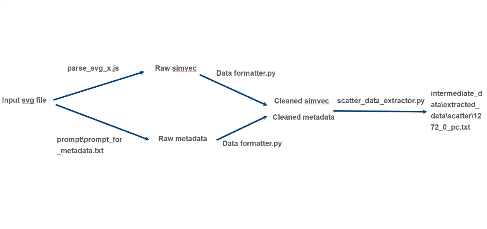

# SVG to Vega-Lite Framework

This framework extracts data from an SVG file and converts it into a [Vega-Lite](https://vega.github.io/vega-lite/) compatible format.  
It currently supports the following chart types:

- Bar chart  
- Line chart  
- Pie chart  
- Scatter plot  

## Pipeline Overview

The overall data extraction and conversion pipeline is illustrated below:

